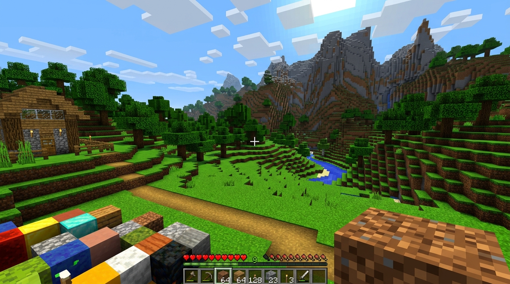

<div align="center">

# ⛏️ YourCraft

### *A Procedural 3D Voxel Sandbox Built Entirely for Modern Web Browsers*

[](https://your-craft.netlify.app/)

[](https://opensource.org/licenses/MIT)
[]()
[](https://threejs.org/)
[]()

---

**Developer:** [Wyzuk](https://github.com/wyzuk)  
**GitHub Repository:** [https://github.com/wyzuk/yourcraft](https://github.com/wyzuk/yourcraft)

</div>

---

# 🌐 Live Demo

**Play YourCraft instantly in your browser:**

🎮 **https://your-craft.netlify.app/**

---

## 🔗 Quick Links

- 🎮 **Live Demo:** [https://your-craft.netlify.app/](https://your-craft.netlify.app/)
- 📂 **GitHub Repository:** [https://github.com/wyzuk/yourcraft](https://github.com/wyzuk/yourcraft)
- 👨‍💻 **Developer:** Wyzuk

---

## 🌟 Overview

**YourCraft** is a fully functional, self-contained single-player 3D procedural voxel sandbox game that runs 100% inside your web browser. Built using modern HTML5, CSS3, ES6 JavaScript modules, and WebGL (Three.js), it features procedural terrain, dynamic lighting, custom pixelated textures, and Web Audio API synthesized sound.

Every launch generates an entirely new procedural world with diverse biomes, dynamic caves, ore deposits, day/night atmospheric lighting, weather, crafting, inventory management, and block physics.

> ⚡ **Zero Installation. Zero Server. Zero Logins. Zero Accounts.**  
> Simply open the link or `index.html` to start playing!

---

## 📸 Screenshots

<div align="center">

| Main Menu | Gameplay |
| :---: | :---: |
|  |  |

| Inventory & Crafting | Dynamic Caves |
| :---: | :---: |
|  |  |

</div>

---

## 🚀 Key Features

* **⚡ Instant Browser Play:**
  * ✔ No installation required
  * ✔ No login required
  * ✔ Runs directly in your browser
  * ✔ Free to play
  * ✔ Hosted on Netlify

* **🎨 Creative Mode & Instant Flying:**
  * Player spawns in **Creative Mode** by default with flying enabled.
  * Hold **Space** to fly up, **Left Shift** to fly down, or double-tap **Space** to toggle flying.
  * Press **C** to switch between Creative and Survival modes.

* **🌍 Endless Procedural World Generation:**
  * Powered by multi-octave Simplex noise heightmaps.
  * 7 distinct biomes: **Plains, Forest, Mountains, Snowy Taiga, Desert, Beach, and Ocean**.
  * 3D underground cave network with lava pools and natural ore veins (**Coal, Iron, Gold, Diamond**).
  * Procedurally generated trees, tall grass, and wild flowers.

* **⛏️ Smooth Block Mining & Building:**
  * Optimized face-culled chunk meshing for stable **60 FPS** performance.
  * Instant block mining with breaking particle explosions and sound effects.
  * Target raycasting up to 5.5 blocks with bounding box selection outline.

* **🎒 Inventory & Crafting Grid:**
  * 36-slot inventory with item stacking up to 64.
  * 9-slot hotbar with scroll wheel and numeric key (`1-9`) instant slot selection.
  * 2x2 and 3x3 (Crafting Table) recipe matrix evaluation for tools, torches, planks, and tables.

* **🌅 Dynamic Day/Night Cycle & Atmosphere:**
  * Orbiting Sun and Moon with dynamic sky color transitions.
  * Ambient lighting shifts, shadow mapping, and distance fog.

* **🔊 Web Audio API Sound Engine:**
  * Synthesizes footsteps, block breaking/placing, jumping, water splashing, and UI clicks procedurally.

---

## 🎮 Controls

| Key / Input | Action |
| :--- | :--- |
| **W, A, S, D** | Move relative to camera direction |
| **Mouse Look** | FPS Pitch & Yaw camera orientation (Pointer Lock API) |
| **Spacebar** | Jump / Hold to fly up (Creative Mode) / Double-tap to toggle Flying |
| **Left Shift** | Sneak / Fly downward in Creative Mode |
| **Left Ctrl** | Sprint |
| **C** | Toggle Creative Mode / Survival Mode |
| **Left Click** | Mine / Destroy targeted block |
| **Right Click** | Place active block from hotbar |
| **Mouse Wheel / 1-9** | Cycle active hotbar slot |
| **E** | Open / Close Inventory & Crafting Modal |
| **ESC** | Pause Game / Release Pointer Lock |
| **F11** | Toggle Fullscreen Mode |

---

## 🖥️ Browser Compatibility

Targeted for smooth **60 FPS** performance on modern browsers supporting **WebGL** and **Pointer Lock API**:

* ✅ Google Chrome
* ✅ Microsoft Edge
* ✅ Mozilla Firefox
* ✅ Opera
* ✅ Brave / Vivaldi

---

## ⚡ How to Run Locally

No installation or complex build steps required!

### Option 1: Direct File Opening
1. Download or clone this repository:
   ```bash
   git clone https://github.com/wyzuk/yourcraft.git
   ```
2. Double-click `index.html` to launch directly in your default browser.

### Option 2: Local Server (VS Code Live Server)
1. Open the project folder in **Visual Studio Code**.
2. Right-click `index.html` and choose **"Open with Live Server"**.

---

## 📁 Repository Structure

```text
/YourCraft
│
├── index.html              # Main HTML entry point & UI overlays
├── style.css               # Pixel art retro theme & HUD styles
├── LICENSE                 # MIT License (© 2026 Wyzuk)
├── README.md               # Project documentation
├── favicon.ico             # Browser icon
│
├── src/                    # Modular ES6 Source Code
│   ├── audio/              # Sound synthesizer
│   ├── camera/             # FPS camera controller
│   ├── chunks/             # Face-culled chunk geometry builder
│   ├── controls/           # Pointer Lock API & WASD input
│   ├── crafting/           # Crafting recipe matrix evaluator
│   ├── inventory/          # Item storage & 64-stack manager
│   ├── physics/            # AABB collision & auto step-up physics
│   ├── player/             # Player movement & flying logic
│   ├── render/             # WebGL renderer, sky & textures
│   ├── terrain/            # Noise & biome heightmap generators
│   ├── ui/                 # HUD, Inventory GUI & toast system
│   ├── utils/              # Config constants & block IDs
│   ├── world/              # Chunk lifecycle & surface spawn finder
│   └── main.js             # Central ES6 entry coordinator
│
└── assets/
    └── screenshots/        # Game preview images
```

---

## 👥 Credits

* **Developer:** Wyzuk
* **GitHub Repository:** [https://github.com/wyzuk/yourcraft](https://github.com/wyzuk/yourcraft)

---

## 📜 License

This project is open-source software licensed under the [MIT License](LICENSE).  
Copyright © 2026 **Wyzuk**.

---

## 🌍 Play Online

Play the latest version here:

**https://your-craft.netlify.app/**

Made with ❤️ by **Wyzuk**

GitHub Repository:  
[https://github.com/wyzuk/yourcraft](https://github.com/wyzuk/yourcraft)
